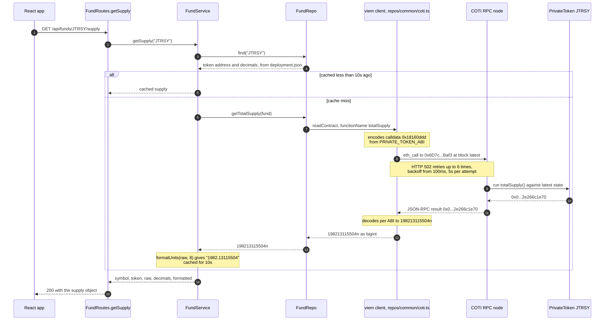
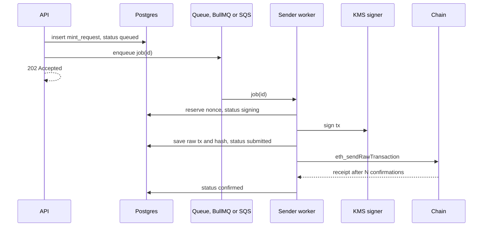

## About

This project was created with [express-generator-typescript](https://github.com/seanpmaxwell/express-generator-typescript).

## Available Scripts

### `npm run clean-install`

Remove the existing `node_modules/` folder, `package-lock.json`, and reinstall all library modules.

### `npm run dev` 

Run the server in development with hot reloading and browser refresh (see `package.json` for all `npm run dev` variations)<br/>

**IMPORTANT** development mode uses `swc` for performance reasons which DOES NOT check for typescript errors. Run `npm run type-check` to check for type errors. NOTE: you should use your IDE to prevent most type errors.

### `npm test`

Run unit-tests with <a href="https://vitest.dev/guide/">vitest</a>.

### `npm run lint`

Check for linting errors.

### `npm run build`

Build the project for production.

### `npm start`

Run the production build (Must be built first).

### `npm run type-check`

Check for typescript errors.

### `npm run sync:contracts`

Refresh the vendored fund contract ABIs and addresses in `src/vendor/rwa/` from GitHub. See [Reading fund data](#reading-fund-data).

### `npm run check:contracts`

Exit non-zero if `src/vendor/rwa/` differs from upstream.

## Reading fund data

The API reads public state from the COTI RWA fund contracts on COTI testnet (chain id `7082400`). Each fund is an ERC-3643 security token whose holder balances are encrypted onchain, so only fund-level figures are public. Today the API serves one of them: the total number of shares issued.

### `GET /api/funds/:symbol/supply`

```
$ curl localhost:3000/api/funds/JTRSY/supply
{
  "supply": {
    "symbol": "JTRSY",
    "token": "0x6D7cf587dbF68eb233B7BEd1f45BDfB6aE31Baf3",
    "raw": "198213115504",
    "decimals": 8,
    "formatted": "1982.13115504"
  }
}
```

| Field | Meaning |
|---|---|
| `symbol` | Fund ticker. The `:symbol` in the URL is matched case-insensitively (`jtrsy` works). |
| `token` | Address of the fund's token contract. |
| `raw` | `totalSupply()` in base units, as a string because it can exceed JavaScript's safe integer range. |
| `decimals` | Decimal places of the share token (8 for every fund). |
| `formatted` | `raw` divided by `10^decimals`, as a decimal string. |

| Status | When |
|---|---|
| `200` | Supply read (or served from cache). |
| `404` | Unknown fund: `{ "error": "Fund not found" }`. The funds are `JTRSY` and `JAAA`. |
| `502` | The chain couldn't be read after retries: `{ "error": "Could not read from COTI testnet" }`. |

### How a request is served

```
routes/FundRoutes.ts        getSupply        validate :symbol
 └ services/FundService.ts  getSupply        look up the fund, cache, map errors, format
    └ repos/FundRepo.ts     getTotalSupply   readContract(token, PRIVATE_TOKEN_ABI, 'totalSupply')
       └ repos/common/coti.ts               viem public client → eth_call on COTI_RPC_URL
```

`FundRepo` is the only module that talks to the chain, which is why the tests stub it there.

### The round trip through viem

[viem](https://viem.sh) is the EVM client library doing the actual chain access. It turns a typed function call into an `eth_call` JSON-RPC request, and the 32-byte answer back into a `bigint`. Nothing else in the API speaks that protocol.



Three things in that exchange are worth naming, because they're what viem contributes:

- **ABI encoding and decoding.** `PRIVATE_TOKEN_ABI` is built with viem's `parseAbi`, so `totalSupply` becomes the 4-byte selector `0x18160ddd` on the way out and a `bigint` on the way back. TypeScript knows that return type at compile time, so a wrong function name or argument list fails the build rather than a request.
- **The transport.** `http()` carries the JSON-RPC call and owns retries, backoff and timeouts, which is what makes the intermittently failing testnet RPC survivable without any retry code of our own.
- **The chain definition.** `defineChain` tells the client the chain id, native currency and known contracts, including Multicall3, which would let several reads share one request.

Writes would use the same library through a wallet client, but this API only reads; it holds no keys and signs nothing.

### Where the ABIs and addresses come from

The fund contracts and the investor dApp live in [plucena/rwa](https://github.com/plucena/rwa). The dApp's `app/src/lib/contracts.ts` (ABIs, chain id, explorer URL) and `app/src/data/deployment.json` (each fund's token, registry, compliance and subscription addresses) are the single source of truth, and this API uses copies of them:

```
src/vendor/rwa/lib/contracts.ts
src/vendor/rwa/data/deployment.json
```

- **After a redeploy** of the contracts, the new addresses land in upstream `deployment.json`, and a sync brings them in.
- **`npm run check:contracts`** fails if the copies have drifted, which makes it suitable for CI.
- The sync script downloads from GitHub. The API never reads a local rwa checkout; a local `rwa` symlink, if you keep one for reference, is gitignored and excluded from tests.

### Configuration

| Variable | Where | Default |
|---|---|---|
| `COTI_RPC_URL` | `config/.env.*` | `https://testnet.coti.io/rpc` |

### Reliability

- **Retries.** The testnet RPC intermittently answers `502`. Each call is retried up to 6 times with exponential backoff from 100ms (about 6s of waiting at most), and each attempt times out after 5s.
- **Cache.** Supplies are cached per fund for 10s, since COTI produces a block roughly every 5s. Concurrent requests for the same fund share one RPC call, and failures are never cached. The cache is in-process, so each running instance keeps its own.

### What can and can't be read

| Readable by the API (public) | Not readable (encrypted) |
|---|---|
| Token: `totalSupply`, `name`, `symbol`, `decimals`, `paused`, `identityRegistry` | Any holder's share balance: `balanceOf` returns a `ctUint256` ciphertext that only the holder's AES key can decrypt |
| Subscription: `priceOf`, `quote` | |
| Identity registry: `isVerified(address)` | |
| Payment stablecoins (USDC.e, USDT): ordinary ERC-20 reads | |

Per-investor positions are therefore out of reach by design. Only the investor, in the dApp, can decrypt their own balance.

### Adding another read

1. **Repo:** add a function to `FundRepo` that calls `coti.readContract` with an ABI from `@src/vendor/rwa/lib/contracts`. If the function you need isn't in the ABI, add it upstream in plucena/rwa and sync, rather than editing the vendored file. For several values at once, use `coti.multicall`; Multicall3 is configured for COTI testnet.
2. **Service:** add a `FundService` function that turns `bigint` values into strings and chain failures into `RouteError`s.
3. **Route:** add the path to `Paths.Funds`, a handler in `FundRoutes`, and register it in `apiRouter`.
4. **Test:** add cases to `tests/funds.test.ts`, stubbing the new repo function with `vi.spyOn` so the suite never touches the testnet.

## Architecture for sending transactions

Nothing below is implemented: today the API only reads, holds no keys and signs nothing. This is the intended shape for when it has to write to the chain.

**The rule: the API never sends transactions.** It records intent in the database and enqueues a job; a dedicated sender worker owns the signing key, the nonce, and the lifecycle of every transaction.



The sender saves the signed transaction and its hash before broadcasting, so after a crash it can rebroadcast the same bytes instead of signing a duplicate.

### Nonce management

- Each sender address has one strictly increasing nonce. Two workers using the same key will collide, so either run one worker per key (a single-concurrency queue) or take a DB row lock: `SELECT next_nonce FROM signers WHERE address=$1 FOR UPDATE`, increment, commit.
- Don't trust `getTransactionCount(addr, 'pending')` alone under load; the mempool view differs between RPC nodes. Track nonces yourself and reconcile against `latest` on startup.
- A nonce gap (nonce 41 never mined) blocks every later transaction. Detect gaps and fill them, for example with a zero-value self-transfer at that nonce.
- Throughput: more signer addresses means more parallel lanes. One lane per key is the simple, safe default.

### Stuck and failed transactions

| Situation | Detect | Action |
|---|---|---|
| Pending too long (underpriced) | No receipt after X blocks | Resend the same nonce with the fee bumped by at least 10% (both `maxFeePerGas` and `maxPriorityFeePerGas`) |
| Dropped from mempool | RPC no longer knows the hash | Rebroadcast the saved raw tx, or re-sign the same nonce |
| Reverted onchain | Receipt `status: 0` | Don't retry blindly: decode the revert reason. The nonce is consumed; mark failed and alert |
| Replaced | A different hash mined at your nonce | Look up which tx mined at that nonce and update the record |
| RPC timeout on send | Unknown | Assume it may have been sent; check by hash before re-signing |

Always `estimateGas` (and ideally simulate with `eth_call`) before sending. A compliance check in an ERC-3643 token that would revert should fail in the service, not onchain at the cost of gas.

### Queue and retries

- BullMQ (Redis) or SQS give at-least-once delivery, so every job handler must be idempotent: check the DB status first and skip if already submitted.
- Use exponential backoff with jitter, and separate transient errors (RPC timeout, 429, a nonce-too-low race) from permanent ones (revert, validation). Retry only the transient ones.
- Add a dead-letter queue plus an alert for jobs that exhaust their retries, and let a human decide.
- SQS FIFO with `MessageGroupId` set to the signer address gives ordered, one-at-a-time processing per key.

### Key management

Keep keys in AWS KMS as `ECC_SECG_P256K1` keys. The worker calls `kms:Sign` on the transaction digest and never sees the private key, and IAM grants that permission only to the worker's role. CloudTrail then holds an audit log of every signature, which regulators like. For client assets, an MPC custody provider such as Fireblocks often replaces KMS.

## Authentication options

`GET /api/funds/:symbol/supply` is currently open. This section describes the ways it could be protected when a React app consumes it, and what each one is actually good for. No approach has been implemented yet.

### What authentication would and wouldn't buy here

The value this endpoint returns is public onchain data. Anyone can read the same `totalSupply()` from any COTI RPC node or the block explorer, so authentication here cannot make the number confidential. What it can do is:

- **Control cost and abuse:** stop an anonymous client from hammering the endpoint and, through it, the RPC.
- **Attribute traffic:** know which app, tenant or user a request came from, for quotas, metering and analytics.
- **Gate a product:** restrict the data to signed-in investors because the business wants that, not because the chain does.
- **Prepare for later endpoints:** anything per-investor (positions, subscription history, KYC status) genuinely needs a caller identity. Choosing an approach now avoids retrofitting one.

Genuinely confidential data is a separate matter: encrypted share balances are readable only with the holder's own key, so no server-side login can unlock them.

### The options

| Approach | How the React app proves itself | Best suited to | Main drawbacks |
|---|---|---|---|
| **Stay public, with limits** | Nothing. Abuse is handled with a CORS allowlist, per-IP rate limiting and caching. | Public marketing sites and dashboards showing fund-level figures. | No caller identity; CORS is not a security boundary, since non-browser clients ignore it. |
| **Public API key** | A key shipped in the React bundle, sent as a header. | Telemetry, per-tenant quotas, cheap traffic separation. | The key is visible to anyone who opens the bundle, so it identifies rather than authenticates. |
| **Wallet sign-in (SIWE, EIP-4361)** | The connected wallet signs a server-issued nonce; the API verifies it and starts a session. | A dApp where the user is already connecting a wallet, and endpoints later become per-address. | Needs nonce issuing, session storage and expiry; an extra signature prompt; identity is an address, not a person. |
| **Accounts via an identity provider (OIDC/OAuth)** | A standard login (email, SSO or social) with the provider's token or session. | An investor portal where KYC, roles and support access matter more than wallet identity. | Brings a user directory and a third-party dependency; wallet address and account then have to be linked deliberately. |
| **Backend-for-frontend (BFF)** | Nothing directly. The browser calls a server the app owns, which holds the credentials and calls this API. | Server-rendered React (Next.js and similar), or when secrets must never reach the browser. | An extra hop to run and deploy; adds latency. |
| **Gateway or edge auth** | Whatever the gateway enforces (JWT check, Cloudflare Access, mTLS for machine clients). | Putting several services behind one policy, or a fixed set of server-side consumers. | Auth lives outside this codebase, so local development and production diverge. |

### Cross-cutting decisions

Any option beyond the first two brings three choices worth deciding explicitly:

- **Where the credential lives in the browser.** An `httpOnly`, `SameSite` cookie is not reachable by JavaScript, so it survives an XSS bug, but it needs CSRF protection and CORS configured for credentialed requests. A bearer token in a header avoids CSRF but is exposed to any script on the page, especially if it's kept in `localStorage`; keeping it in memory only and refreshing it limits the damage.
- **Session lifetime.** Short-lived tokens with a refresh step contain the damage from a leak. Wallet sessions in particular should expire, since a signature is not revocable on its own.
- **What it does to caching.** This endpoint is a cacheable GET, and its values change slowly. Per-user credentials make responses private and defeat shared caches (CDN or reverse proxy), so a public, cacheable fund-level route and a private per-investor route are often better kept separate.

### A reasonable path

Keep fund-level reads public, and put a CORS allowlist plus per-IP rate limiting in front of them. That matches what the data is, and keeps the route cacheable. Add wallet sign-in when the first per-investor endpoint appears, since the dApp already connects a wallet and signs, and reach for an identity provider only when the product needs real accounts, roles or KYC rather than addresses.

## Additional Notes

- If `npm run dev` gives you issues with bcrypt on MacOS you may need to run: `npm rebuild bcrypt --build-from-source`.
