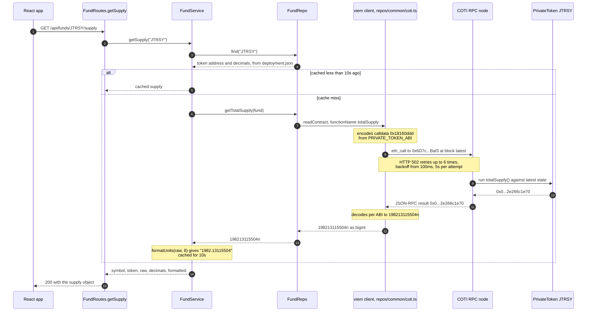
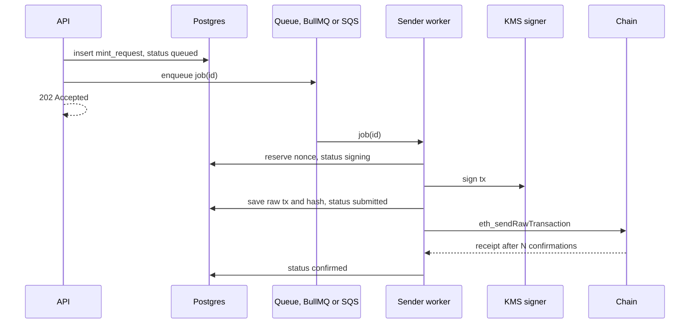
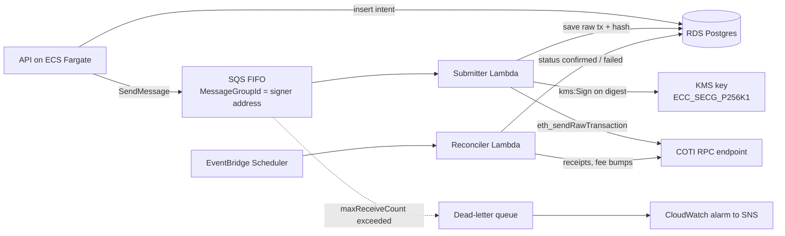

## About

This project was created with [express-generator-typescript](https://github.com/seanpmaxwell/express-generator-typescript).

## Available Scripts

### `npm run clean-install`

Remove the existing `node_modules/` folder, `package-lock.json`, and reinstall all library modules.

### `npm run dev` 

Run the server in development with hot reloading and browser refresh (see `package.json` for all `npm run dev` variations)<br/>

**IMPORTANT** development mode uses `swc` for performance reasons which DOES NOT check for typescript errors. Run `npm run type-check` to check for type errors. NOTE: you should use your IDE to prevent most type errors.

### `npm test`

Run unit-tests with <a href="https://vitest.dev/guide/">vitest</a>.

### `npm run lint`

Check for linting errors.

### `npm run build`

Build the project for production.

### `npm start`

Run the production build (Must be built first).

### `npm run type-check`

Check for typescript errors.

### `npm run sync:contracts`

Refresh the vendored fund contract ABIs and addresses in `src/vendor/rwa/` from GitHub. See [Reading fund data](#reading-fund-data).

### `npm run check:contracts`

Exit non-zero if `src/vendor/rwa/` differs from upstream.

## Reading fund data

The API reads public state from the COTI RWA fund contracts on COTI testnet (chain id `7082400`). Each fund is an ERC-3643 security token whose holder balances are encrypted onchain, so only fund-level figures are public. Today the API serves one of them: the total number of shares issued.

### `GET /api/funds/:symbol/supply`

```
$ curl localhost:3000/api/funds/JTRSY/supply
{
  "supply": {
    "symbol": "JTRSY",
    "token": "0x6D7cf587dbF68eb233B7BEd1f45BDfB6aE31Baf3",
    "raw": "198213115504",
    "decimals": 8,
    "formatted": "1982.13115504"
  }
}
```

| Field | Meaning |
|---|---|
| `symbol` | Fund ticker. The `:symbol` in the URL is matched case-insensitively (`jtrsy` works). |
| `token` | Address of the fund's token contract. |
| `raw` | `totalSupply()` in base units, as a string because it can exceed JavaScript's safe integer range. |
| `decimals` | Decimal places of the share token (8 for every fund). |
| `formatted` | `raw` divided by `10^decimals`, as a decimal string. |

| Status | When |
|---|---|
| `200` | Supply read (or served from cache). |
| `404` | Unknown fund: `{ "error": "Fund not found" }`. The funds are `JTRSY` and `JAAA`. |
| `502` | The chain couldn't be read after retries: `{ "error": "Could not read from COTI testnet" }`. |

### How a request is served

```
routes/FundRoutes.ts        getSupply        validate :symbol
 └ services/FundService.ts  getSupply        look up the fund, cache, map errors, format
    └ repos/FundRepo.ts     getTotalSupply   readContract(token, PRIVATE_TOKEN_ABI, 'totalSupply')
       └ repos/common/coti.ts               viem public client → eth_call on COTI_RPC_URL
```

`FundRepo` is the only module that talks to the chain, which is why the tests stub it there.

### The round trip through viem

[viem](https://viem.sh) is the EVM client library doing the actual chain access. It turns a typed function call into an `eth_call` JSON-RPC request, and the 32-byte answer back into a `bigint`. Nothing else in the API speaks that protocol.



Three things in that exchange are worth naming, because they're what viem contributes:

- **ABI encoding and decoding.** `PRIVATE_TOKEN_ABI` is built with viem's `parseAbi`, so `totalSupply` becomes the 4-byte selector `0x18160ddd` on the way out and a `bigint` on the way back. TypeScript knows that return type at compile time, so a wrong function name or argument list fails the build rather than a request.
- **The transport.** `http()` carries the JSON-RPC call and owns retries, backoff and timeouts, which is what makes the intermittently failing testnet RPC survivable without any retry code of our own.
- **The chain definition.** `defineChain` tells the client the chain id, native currency and known contracts, including Multicall3, which would let several reads share one request.

Writes would use the same library through a wallet client, but this API only reads; it holds no keys and signs nothing.

### Where the ABIs and addresses come from

The fund contracts and the investor dApp live in [plucena/rwa](https://github.com/plucena/rwa). The dApp's `app/src/lib/contracts.ts` (ABIs, chain id, explorer URL) and `app/src/data/deployment.json` (each fund's token, registry, compliance and subscription addresses) are the single source of truth, and this API uses copies of them:

```
src/vendor/rwa/lib/contracts.ts
src/vendor/rwa/data/deployment.json
```

- **After a redeploy** of the contracts, the new addresses land in upstream `deployment.json`, and a sync brings them in.
- **`npm run check:contracts`** fails if the copies have drifted, which makes it suitable for CI.
- The sync script downloads from GitHub. The API never reads a local rwa checkout; a local `rwa` symlink, if you keep one for reference, is gitignored and excluded from tests.

### Configuration

| Variable | Where | Default |
|---|---|---|
| `COTI_RPC_URL` | `config/.env.*` | `https://testnet.coti.io/rpc` |

### Reliability

- **Retries.** The testnet RPC intermittently answers `502`. Each call is retried up to 6 times with exponential backoff from 100ms (about 6s of waiting at most), and each attempt times out after 5s.
- **Cache.** Supplies are cached per fund for 10s, since COTI produces a block roughly every 5s. Concurrent requests for the same fund share one RPC call, and failures are never cached. The cache is in-process, so each running instance keeps its own.

### What can and can't be read

| Readable by the API (public) | Not readable (encrypted) |
|---|---|
| Token: `totalSupply`, `name`, `symbol`, `decimals`, `paused`, `identityRegistry` | Any holder's share balance: `balanceOf` returns a `ctUint256` ciphertext that only the holder's AES key can decrypt |
| Subscription: `priceOf`, `quote` | |
| Identity registry: `isVerified(address)` | |
| Payment stablecoins (USDC.e, USDT): ordinary ERC-20 reads | |

Per-investor positions are therefore out of reach by design. Only the investor, in the dApp, can decrypt their own balance.

### Adding another read

1. **Repo:** add a function to `FundRepo` that calls `coti.readContract` with an ABI from `@src/vendor/rwa/lib/contracts`. If the function you need isn't in the ABI, add it upstream in plucena/rwa and sync, rather than editing the vendored file. For several values at once, use `coti.multicall`; Multicall3 is configured for COTI testnet.
2. **Service:** add a `FundService` function that turns `bigint` values into strings and chain failures into `RouteError`s.
3. **Route:** add the path to `Paths.Funds`, a handler in `FundRoutes`, and register it in `apiRouter`.
4. **Test:** add cases to `tests/funds.test.ts`, stubbing the new repo function with `vi.spyOn` so the suite never touches the testnet.

## Architecture for sending transactions

Nothing below is implemented: today the API only reads, holds no keys and signs nothing. This is the intended shape for when it has to write to the chain.

**The rule: the API never sends transactions.** It records intent in the database and enqueues a job; a dedicated sender worker owns the signing key, the nonce, and the lifecycle of every transaction.



The sender saves the signed transaction and its hash before broadcasting, so after a crash it can rebroadcast the same bytes instead of signing a duplicate.

### Idempotency keys

Every write request carries an `Idempotency-Key` header. It exists for one failure: the client sends a request, the response is lost, and the client cannot tell whether the transaction was accepted. Retrying without a key risks a second mint; refusing to retry risks losing the request.

**The client generates the key, never the server.** A client that never saw the response would have no server-issued key to retry with, which is the exact case the key is for. The React app creates one when the user commits to the action, with `crypto.randomUUID()`, and reuses that same value for every retry of that action, including after a timeout or a reload while the intent is still pending. A new key means a new intent.

UUIDv7 is the preferred shape: random, but time-ordered, so it indexes with good locality and old keys cluster for cleanup. UUIDv4 and ULID are fine too. The server treats it as an opaque string, caps its length and rejects anything longer.

**How the API honours it**

- **Scope it per caller:** `UNIQUE (caller_id, endpoint, idempotency_key)`. A global scope would let one tenant burn another's key.
- **Store a fingerprint** of the request body next to the key, such as a SHA-256 of its canonical JSON, so a key reused for different content can be told apart from an honest retry.
- **Insert before working**, in the same transaction that records the intent. The unique violation *is* the concurrency guard: of two racing requests, one insert wins and the loser reads the winner's row. Don't check first and insert after.
- **Keep keys for about 24 hours**, then purge. That covers any reasonable retry window.

A repeat of a key already seen resolves like this:

| Repeat request | Answer |
|---|---|
| Same fingerprint, still in flight | `409`, or `202` with the original request id |
| Same fingerprint, finished | Replay the stored response, same status and body |
| Different fingerprint | `422`: the key was reused for a different request |

**Three layers, three hops.** The key is only the first guard. The API's unique constraint stops a duplicate intent row; the queue's `MessageDeduplicationId`, set to the same key, catches a duplicate enqueue, though SQS FIFO's dedupe window is only 5 minutes, so treat it as convenience rather than guarantee; and the nonce is the backstop, since a transaction signed at nonce 42 cannot be mined twice. The database row is what makes the API idempotent, but only the nonce makes the chain idempotent.

**The natural-key alternative.** A key can instead be derived from the business facts, for example a hash of investor, fund, amount and intent id, which needs no client cooperation. It also collapses legitimate duplicates: two identical subscriptions a minute apart become one. Use it only where a true duplicate is impossible by definition, such as one subscription per investor per period.

### Nonce management

- Each sender address has one strictly increasing nonce. Two workers using the same key will collide, so either run one worker per key (a single-concurrency queue) or take a DB row lock: `SELECT next_nonce FROM signers WHERE address=$1 FOR UPDATE`, increment, commit.
- Don't trust `getTransactionCount(addr, 'pending')` alone under load; the mempool view differs between RPC nodes. Track nonces yourself and reconcile against `latest` on startup.
- A nonce gap (nonce 41 never mined) blocks every later transaction. Detect gaps and fill them, for example with a zero-value self-transfer at that nonce.
- Throughput: more signer addresses means more parallel lanes. One lane per key is the simple, safe default.

### Stuck and failed transactions

| Situation | Detect | Action |
|---|---|---|
| Pending too long (underpriced) | No receipt after X blocks | Resend the same nonce with the fee bumped by at least 10% (both `maxFeePerGas` and `maxPriorityFeePerGas`) |
| Dropped from mempool | RPC no longer knows the hash | Rebroadcast the saved raw tx, or re-sign the same nonce |
| Reverted onchain | Receipt `status: 0` | Don't retry blindly: decode the revert reason. The nonce is consumed; mark failed and alert |
| Replaced | A different hash mined at your nonce | Look up which tx mined at that nonce and update the record |
| RPC timeout on send | Unknown | Assume it may have been sent; check by hash before re-signing |

Always `estimateGas` (and ideally simulate with `eth_call`) before sending. A compliance check in an ERC-3643 token that would revert should fail in the service, not onchain at the cost of gas.

### How the reconciler checks status

There is no gRPC option: EVM nodes speak JSON-RPC over HTTP and WebSocket, and gRPC belongs to Cosmos-style chains and to Erigon's internal interfaces, not to a public EVM API. So the question is only which JSON-RPC calls to make, and against which node.

What the public COTI testnet endpoint supports, checked against it directly:

| Capability | Result |
|---|---|
| `eth_getTransactionReceipt`, `eth_getLogs`, JSON-RPC batching | Work; several calls fit in one HTTP request |
| `eth_subscribe` over HTTP | `notifications not supported` |
| WebSocket endpoint (`/ws`, `/websocket`) | 404, so push is unavailable on the shared endpoint |
| Explorer API (cotiscan runs Blockscout) | Works, both `/api/v2/transactions/{hash}` and the Etherscan-style `gettxreceiptstatus` |

On the public RPC the reconciler therefore polls. Push needs a node of your own.

| Approach | Cost per tick | Catches | Notes |
|---|---|---|---|
| **Per-hash receipt polling** | One call per pending tx, batchable | Mined and reverted (`status: 0`) | The default; batching keeps it cheap while few transactions are in flight |
| **Per-signer nonce check** | One call per signer | Whether anything can still be pending | `eth_getTransactionCount(addr, 'latest')` past your nonce with no receipt means replaced or dropped. The cheapest early filter |
| **Head-following block scan** | One call per block | Everything, including replacements | `eth_getBlockByNumber(n, true)`, matched on sender and nonce. Scales with block rate rather than pending count, and identifies the transaction that took your nonce |
| **`eth_getLogs` by contract and topic** | One call per range | Successful, event-emitting calls | A reverted transaction emits no logs, so logs alone cannot separate reverted from pending. Only useful when the event carries the intent id, and only alongside receipts |
| **WebSocket `newHeads`** | Push | Head updates, with the lowest latency | Needs your own node and a long-lived process; Lambda cannot hold a socket |
| **Explorer API** | One HTTP call | Mined and reverted | An indexer: it lags and rate-limits. Fine as a cross-check or for debugging by hand, wrong as the source of truth |
| **Self-hosted indexer** (Ponder, Subsquid, Blockscout) | Push, into SNS or EventBridge | Whatever is indexed | Makes reconciliation event-driven, but is another service to run and still polls a node underneath |

**Escaping the shared endpoint.** Two routes, and the first is the one to try:

- **A dedicated endpoint from a managed provider**, the QuickNode pattern: your own keyed URL with your own quota, WebSocket push, and webhook-style streams, with none of the operating work. The COTI stack already does this elsewhere — `@coti-io/coti-wallet-plugin` ships a keyed QuickNode URL for its Sepolia leg. Two caveats. QuickNode's **gRPC (Yellowstone) is Solana-only**; every EVM chain there is HTTPS and WSS, so don't plan a gRPC transport for an EVM leg. And COTI itself isn't on QuickNode's chain list, so this helps the Sepolia or Avalanche side of a bridge flow, not COTI reads. Keep any such key server-side: the one in the plugin ships inside a browser bundle, which makes it public and spendable by anyone.
- **Running a node yourself**, which for COTI is the only way to get push and an honest mempool view. It buys freedom from another operator's limits at the price of a synced chain to look after: EC2 or ECS in a private subnet, in the workers' region, behind internal DNS, doubled if an outage would matter. That trade is more attractive on COTI testnet than on a mature chain, since the shared endpoint drops a large share of requests — but confirm what a node image and an initial sync actually involve before committing to it.

Cheapest of all, before either: give the client a viem `fallback()` transport across every endpoint you have, so one operator's bad minute isn't an outage.

**Suggested default.** Poll a cheap pair: one nonce check per signer per tick, and batched receipt polls only for transactions that can still be pending. That distinguishes mined, reverted and dropped in a handful of calls however many intents are in flight. Move to a head-following scan when volume makes per-hash polling noisy, and add your own node with WebSocket only when latency or rate limits actually hurt.

One rule worth encoding: `eth_getTransactionByHash` returning null means *that node* has forgotten the transaction, and nodes disagree about pending state. Treat the `latest` nonce as truth, never the mempool view.

### Queue and retries

- BullMQ (Redis) or SQS give at-least-once delivery, so every job handler must be idempotent: check the DB status first and skip if already submitted.
- Use exponential backoff with jitter, and separate transient errors (RPC timeout, 429, a nonce-too-low race) from permanent ones (revert, validation). Retry only the transient ones.
- Add a dead-letter queue plus an alert for jobs that exhaust their retries, and let a human decide.
- SQS FIFO with `MessageGroupId` set to the signer address gives ordered, one-at-a-time processing per key.

### Key management

Keep keys in AWS KMS as `ECC_SECG_P256K1` keys. The worker calls `kms:Sign` on the transaction digest and never sees the private key, and IAM grants that permission only to the worker's role. CloudTrail then holds an audit log of every signature, which regulators like. For client assets, an MPC custody provider such as Fireblocks often replaces KMS.

### Running the sender worker on AWS

The worker splits into two jobs that must not be combined: a **submitter** that signs and broadcasts one transaction, and a **reconciler** that watches pending transactions and decides whether to bump, rebroadcast or fail them. Waiting for confirmations inside the submitter would hold a queue message (or bill Lambda time) for minutes, and it loses the work entirely if the process dies mid-wait.



**Components**

| Concern | Service | Notes |
|---|---|---|
| Queue | SQS FIFO | `MessageGroupId` = signer address, `MessageDeduplicationId` = request id (the dedupe window is 5 minutes, so the DB status check is still the real idempotency guard). |
| Submitter | Lambda, or an ECS Fargate consumer | Lambda's SQS FIFO event source runs at most one invocation per message group, which serialises a signer's nonce for free. Fargate needs one consumer per key to get the same guarantee. |
| Reconciler | Lambda on an EventBridge schedule | Runs every few seconds to a minute over transactions in `submitted`, applying the stuck-and-failed table above. |
| State | RDS or Aurora Postgres | Holds the intent rows and the `signers` table the nonce lock lives in. DynamoDB works too, with a conditional update or atomic counter in place of `SELECT ... FOR UPDATE`. |
| Signing | KMS | One key per signer lane. |
| Config | SSM Parameter Store or Secrets Manager | RPC URL, contract addresses, tuning values. |

**Signing with KMS, in detail.** Ethereum signs a 32-byte keccak digest, so call `Sign` with `MessageType: DIGEST` and `SigningAlgorithm: ECDSA_SHA_256`, which tells KMS to sign the bytes as given rather than hashing them again. KMS returns a DER-encoded signature, and turning it into an Ethereum one takes three steps: parse out `r` and `s`; normalise `s` to the lower half of the curve order, since EIP-2 rejects the high form; then recover `v` by trying both recovery ids and keeping the one that recovers the signer's address. The address itself comes from `GetPublicKey`, whose DER answer holds the uncompressed point to keccak-hash. Libraries such as `@rumblefishdev/eth-signer-kms` package all of this, and are worth using rather than re-deriving.

**Ordering and concurrency.** One KMS key equals one nonce lane equals one message group. Scale throughput by adding signer addresses and granting each the agent role onchain, never by raising concurrency on a single key. If you use Fargate instead of Lambda, run one service per key rather than one service with several tasks, and keep queue polling long (20s) to avoid busy loops.

**Retries and failure.** Set the queue's visibility timeout above the submitter's worst case, including the KMS call and RPC retries, so a slow run isn't delivered twice. Keep `maxReceiveCount` low (3 or so), and alarm on the DLQ's depth as well as on `ApproximateAgeOfOldestMessage`, which catches a lane wedged by a nonce gap. Emit the age of the oldest unconfirmed transaction as a custom CloudWatch metric; that single number tends to be the best early warning that the chain, the fee market or a nonce has gone wrong.

**Network and IAM.** Put Lambdas and tasks in private subnets. Reaching a public RPC endpoint needs a NAT gateway, while KMS, SQS, Secrets Manager and CloudWatch can go through VPC interface endpoints, which keeps that traffic off the internet and cuts NAT cost. Give the submitter's role `kms:Sign` and `kms:GetPublicKey` on exactly one key ARN and nothing else, and let the key policy name that role; the API's own role should have no KMS permission at all, only `sqs:SendMessage`. Asymmetric KMS keys don't support automatic rotation, so plan key changes as an onchain role migration: authorise the new signer, drain the old lane, revoke it.

**Observability.** CloudTrail records every `Sign` call, which is the audit trail regulators ask for; keep it in an account the worker can't write to. Log the request id, nonce, transaction hash and status transition on one structured line each, so a transaction's whole life can be read from its id.

**The smallest setup that works:** one SQS FIFO queue, one submitter Lambda, one reconciler Lambda on a one-minute schedule, one KMS key, one Postgres table for intents plus one for nonces, and a DLQ alarm. Reach for more signer keys, ECS consumers or Step Functions only when a real limit pushes you there.

## Authentication options

`GET /api/funds/:symbol/supply` is currently open. This section describes the ways it could be protected when a React app consumes it, and what each one is actually good for. No approach has been implemented yet.

### What authentication would and wouldn't buy here

The value this endpoint returns is public onchain data. Anyone can read the same `totalSupply()` from any COTI RPC node or the block explorer, so authentication here cannot make the number confidential. What it can do is:

- **Control cost and abuse:** stop an anonymous client from hammering the endpoint and, through it, the RPC.
- **Attribute traffic:** know which app, tenant or user a request came from, for quotas, metering and analytics.
- **Gate a product:** restrict the data to signed-in investors because the business wants that, not because the chain does.
- **Prepare for later endpoints:** anything per-investor (positions, subscription history, KYC status) genuinely needs a caller identity. Choosing an approach now avoids retrofitting one.

Genuinely confidential data is a separate matter: encrypted share balances are readable only with the holder's own key, so no server-side login can unlock them.

### The options

| Approach | How the React app proves itself | Best suited to | Main drawbacks |
|---|---|---|---|
| **Stay public, with limits** | Nothing. Abuse is handled with a CORS allowlist, per-IP rate limiting and caching. | Public marketing sites and dashboards showing fund-level figures. | No caller identity; CORS is not a security boundary, since non-browser clients ignore it. |
| **Public API key** | A key shipped in the React bundle, sent as a header. | Telemetry, per-tenant quotas, cheap traffic separation. | The key is visible to anyone who opens the bundle, so it identifies rather than authenticates. |
| **Wallet sign-in (SIWE, EIP-4361)** | The connected wallet signs a server-issued nonce; the API verifies it and starts a session. | A dApp where the user is already connecting a wallet, and endpoints later become per-address. | Needs nonce issuing, session storage and expiry; an extra signature prompt; identity is an address, not a person. |
| **Accounts via an identity provider (OIDC/OAuth)** | A standard login (email, SSO or social) with the provider's token or session. | An investor portal where KYC, roles and support access matter more than wallet identity. | Brings a user directory and a third-party dependency; wallet address and account then have to be linked deliberately. |
| **Backend-for-frontend (BFF)** | Nothing directly. The browser calls a server the app owns, which holds the credentials and calls this API. | Server-rendered React (Next.js and similar), or when secrets must never reach the browser. | An extra hop to run and deploy; adds latency. |
| **Gateway or edge auth** | Whatever the gateway enforces (JWT check, Cloudflare Access, mTLS for machine clients). | Putting several services behind one policy, or a fixed set of server-side consumers. | Auth lives outside this codebase, so local development and production diverge. |

### Cross-cutting decisions

Any option beyond the first two brings three choices worth deciding explicitly:

- **Where the credential lives in the browser.** An `httpOnly`, `SameSite` cookie is not reachable by JavaScript, so it survives an XSS bug, but it needs CSRF protection and CORS configured for credentialed requests. A bearer token in a header avoids CSRF but is exposed to any script on the page, especially if it's kept in `localStorage`; keeping it in memory only and refreshing it limits the damage.
- **Session lifetime.** Short-lived tokens with a refresh step contain the damage from a leak. Wallet sessions in particular should expire, since a signature is not revocable on its own.
- **What it does to caching.** This endpoint is a cacheable GET, and its values change slowly. Per-user credentials make responses private and defeat shared caches (CDN or reverse proxy), so a public, cacheable fund-level route and a private per-investor route are often better kept separate.

### A reasonable path

Keep fund-level reads public, and put a CORS allowlist plus per-IP rate limiting in front of them. That matches what the data is, and keeps the route cacheable. Add wallet sign-in when the first per-investor endpoint appears, since the dApp already connects a wallet and signs, and reach for an identity provider only when the product needs real accounts, roles or KYC rather than addresses.

## Additional Notes

- If `npm run dev` gives you issues with bcrypt on MacOS you may need to run: `npm rebuild bcrypt --build-from-source`.
